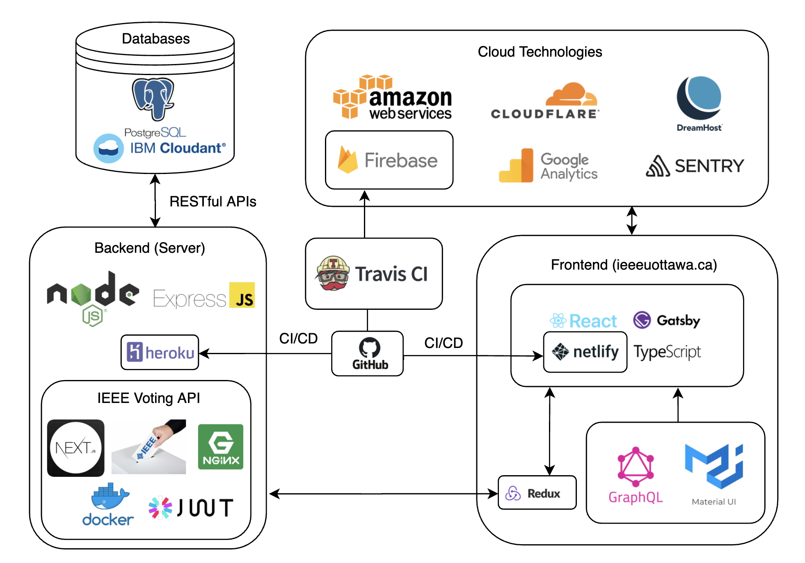

<table align="center"><tr><td align="center" width="9999">


# IEEE uOttawa Student Branch Website

</td></tr></table>


<p align="center">
  
</p>


## Contributors
1. Rushil Perera (Webmaster 2018/2019)
2. Nevin WS Ganesan (Webmaster 2019/2020)
3. Ryan Fleck (Webmaster 2020/2021)

### Past Webmasters
1. Tamer Sherif (Webmaster 2017/2018)
2. Rushil Perera (Webmaster 2018/2019)
3. Nevin WS Ganesan (Webmaster 2019/2020)


## Installation

1. Make sure that you have the Gatsby CLI program installed:
```sh
npm install --global gatsby-cli
```

2. Run frontend (Gatsby.js) by running these commands:
```sh
cd frontend && yarn install && yarn start
```

3. Run backend (Express.js) by running these commands:
```sh
cd backend && yarn install && yarn start
```

4. Alternatively:
```sh
(cd frontend && yarn install && yarn start) & (cd backend && yarn install && yarn start)
```

5. OR
```sh
sh run.sh
```
